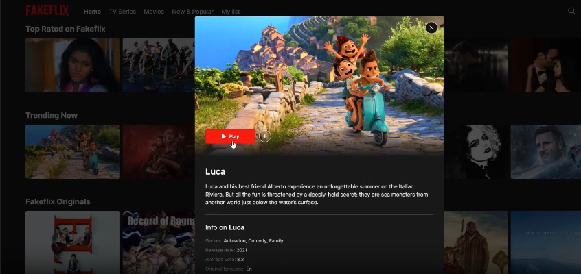
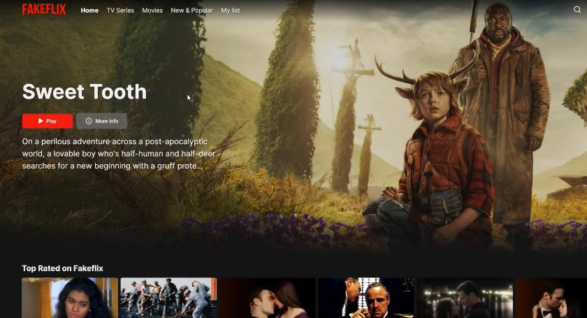

<a href="https://your-netflix-clone.netlify.app">
  
  <h1 align="center">Netflix Clone</h1>
</a>

<p align="center">
  Advanced Netflix replica with modern React architecture and premium features.
</p>

<p align="center">
  <a href="https://github.com/shivas1432">
    
  </a>
  <a href="https://linkedin.com/in/shivashanker-kanugula-51a512252">
    
  </a>
</p>

<p align="center">
  <a href="#-about"><strong>About</strong></a> ·
  <a href="#%EF%B8%8F-demo"><strong>Demo</strong></a> ·
  <a href="#sparkles-features"><strong>Features</strong></a> ·
  <a href="#rocket-technologies"><strong>Technologies</strong></a> ·
  <a href="#-screenshots"><strong>Screenshots</strong></a> ·
  <a href="#-run-locally"><strong>Run Locally</strong></a> ·
  <a href="#white_check_mark-requirements"><strong>Requirements</strong></a> ·
  <a href="#-license"><strong>License</strong></a> ·
  <a href="#-support"><strong>Support</strong></a>
</p>
<br/>

## 🎯 About

This Netflix clone represents a sophisticated streaming platform replica built with modern React architecture. The project demonstrates advanced front-end development skills, including complex state management with Redux, real-time data fetching, and pixel-perfect UI implementation.

I've focused on creating not just a visual clone, but a fully functional streaming interface that showcases:
- **Advanced React Patterns:** Custom hooks, context API, and component composition
- **State Management:** Redux with middleware (Thunk & Saga) for complex async operations  
- **Modern Authentication:** Firebase Auth with Google Sign-In integration
- **Performance Optimization:** Code splitting, lazy loading, and optimized re-renders
- **Responsive Design:** Mobile-first approach with seamless cross-device experience

The application features a complete user authentication system, dynamic content loading from TMDB API, personalized watchlists, advanced search functionality, and smooth animations that rival the original Netflix experience.

<br/>

## ▶️ Demo

**Live Demo:** [Netflix Replica by Shivashanker](https://your-netflix-replica.netlify.app)

### 🎬 Video Demo

[🎥 Watch Full Demo](./public/demo.mp4)

*Click above to download and watch the complete Netflix Replica demonstration*

### 📸 Screenshots

**Desktop Experience**


**Mobile Experience**


### Test Credentials (Quick Access)

> **Email:** testuser@netflixreplica.com<br/>
> **Password:** TestUser2025<br/>

*Or use the "Sign in with Google" option for instant access.*

<br/>

## :sparkles: Features

:heavy_check_mark: &nbsp;&nbsp;**Complete Netflix UI:** Pixel-perfect recreation with modern enhancements<br />
:heavy_check_mark: &nbsp;&nbsp;**User Authentication:** Sign up, sign in, Google Auth, and anonymous access<br />
:heavy_check_mark: &nbsp;&nbsp;**Dynamic Content:** Real movie/TV data from TMDB API<br />
:heavy_check_mark: &nbsp;&nbsp;**Personal Watchlist:** Add/remove favorites with persistence<br />
:heavy_check_mark: &nbsp;&nbsp;**Advanced Search:** Filter by title, actor, director, or genre<br />
:heavy_check_mark: &nbsp;&nbsp;**Category Browsing:** Infinite scroll through curated categories<br />
:heavy_check_mark: &nbsp;&nbsp;**Detail Modals:** Comprehensive movie/show information<br />
:heavy_check_mark: &nbsp;&nbsp;**Netflix Animations:** Authentic splash screen and play animations<br />
:heavy_check_mark: &nbsp;&nbsp;**Audio Experience:** Netflix "ta-dum" sound integration<br />
:heavy_check_mark: &nbsp;&nbsp;**Responsive Design:** Seamless mobile and desktop experience<br />
:heavy_check_mark: &nbsp;&nbsp;**Performance Optimized:** Lazy loading, code splitting, and caching<br />
:heavy_check_mark: &nbsp;&nbsp;**State Persistence:** User preferences and session management<br />
:heavy_check_mark: &nbsp;&nbsp;**Loading States:** Skeleton screens and smooth transitions<br />
:heavy_check_mark: &nbsp;&nbsp;**Error Handling:** Graceful error boundaries and fallbacks<br />
:heavy_check_mark: &nbsp;&nbsp;**Accessibility:** WCAG compliant with keyboard navigation<br />

<br/>

## :rocket: Technologies

### **Core Framework**
- [React 17](https://reactjs.org/) - Component-based UI library
- [React Hooks](https://reactjs.org/docs/hooks-intro.html) - Modern state management
- [React Router DOM](https://reactrouter.com/) - Client-side routing

### **State Management**
- [Redux](https://redux.js.org/) - Predictable state container
- [Redux Thunk](https://github.com/reduxjs/redux-thunk) - Async action creators
- [Redux Saga](https://redux-saga.js.org/) - Side effect management
- [Redux Persist](https://github.com/rt2zz/redux-persist) - State persistence
- [Reselect](https://github.com/reduxjs/reselect) - Memoized selectors

### **Backend & APIs**
- [Firebase](https://firebase.google.com/) - Authentication & Database
- [TMDB API](https://www.themoviedb.org/) - Movie/TV show data
- [Axios](https://axios-http.com/) - HTTP client

### **UI & Styling**
- [SCSS/Sass](https://sass-lang.com/) - Advanced CSS preprocessing
- [Framer Motion](https://www.framer.com/motion/) - Animation library
- [SwiperJS](https://swiperjs.com/react) - Touch-enabled carousels
- [React Icons](https://react-icons.github.io/react-icons/) - Icon library

### **Development & Quality**
- [React Hook Form](https://react-hook-form.com/) - Form validation
- [ESLint](https://eslint.org/) - Code linting
- [Prettier](https://prettier.io/) - Code formatting
- [Husky](https://typicode.github.io/husky/) - Git hooks

### **Deployment**
- [Netlify](https://www.netlify.com/) - Hosting and CI/CD
- [Vercel](https://vercel.com/) - Alternative deployment option

<br/>

## 📸 Screenshots

**Homepage with Dynamic Content**


**Mobile Responsive Design**


**Video Demonstration**

[🎥 Watch Full Demo Video](./public/demo.mp4)

*Complete walkthrough showcasing all features and functionality*

<br/>

## 👨🏻‍💻 Run Locally

### **Clone and Setup**

```bash
# Clone the repository
git clone https://github.com/shivas1432/netflix-replica.git

# Navigate to project directory
cd netflix-replica

# Install dependencies
npm install
```

### **Environment Configuration**

Create a `.env` file in the root directory:

```env
# TMDB API Configuration
REACT_APP_API_KEY=your_tmdb_api_key_here

# Firebase Configuration
REACT_APP_FIREBASE_API_KEY=your_firebase_api_key
REACT_APP_FIREBASE_AUTH_DOMAIN=your_project.firebaseapp.com
REACT_APP_FIREBASE_PROJECT_ID=your_project_id
REACT_APP_FIREBASE_STORAGE_BUCKET=your_project.appspot.com
REACT_APP_FIREBASE_MESSAGING_SENDER_ID=your_sender_id
REACT_APP_FIREBASE_APP_ID=your_app_id
REACT_APP_FIREBASE_MEASUREMENT_ID=your_measurement_id
```

### **API Keys Setup**

1. **TMDB API Key:**
   - Visit [TMDB](https://www.themoviedb.org/settings/api)
   - Create account and request API key
   - Add to `.env` file

2. **Firebase Setup:**
   - Go to [Firebase Console](https://console.firebase.google.com/)
   - Create new project
   - Enable Authentication (Email/Password + Google)
   - Get configuration from Project Settings
   - Add all config values to `.env` file

### **Start Development Server**

```bash
# Start the application
npm start

# Application will open at http://localhost:3000
```

<br/>

## :white_check_mark: Requirements

**Prerequisites:**
- [Node.js](https://nodejs.org/) (v14 or higher)
- [Git](https://git-scm.com/)
- npm or yarn package manager

**API Accounts Required:**
- TMDB API account (free)
- Firebase project (free tier available)

<br/>

## 🚀 Deployment

### **Netlify Deployment**

1. **Connect Repository:**
   - Link your GitHub repository to Netlify
   - Select the main/master branch

2. **Build Configuration:**
   ```bash
   Build command: npm run build
   Publish directory: build
   Node version: 16
   ```

3. **Environment Variables:**
   - Add all your `.env` variables in Netlify dashboard
   - Go to Site Settings → Environment Variables

4. **Deploy:**
   - Automatic deployment on every push to main branch

### **Manual Deployment**

```bash
# Build for production
npm run build

# Deploy the build folder to your hosting service
```

<br/>

## 🤝 Contributing

Contributions are welcome! Here's how you can help:

### **How to Contribute**

1. **Fork** the repository
2. **Create** a feature branch (`git checkout -b feature/amazing-feature`)
3. **Commit** your changes (`git commit -m 'Add amazing feature'`)
4. **Push** to the branch (`git push origin feature/amazing-feature`)
5. **Open** a Pull Request

### **Contribution Ideas**

- 🎬 **Additional Features:** Trailers, reviews, ratings
- 🔍 **Enhanced Search:** Voice search, filters, suggestions
- 📱 **Mobile Improvements:** Offline support, PWA features
- 🎨 **UI/UX:** Dark/light themes, accessibility improvements
- 🚀 **Performance:** Bundle optimization, caching strategies
- 🧪 **Testing:** Unit tests, integration tests, E2E tests

<br/>

## 🏗️ Project Structure

```
netflix-clone/
├── public/                 # Static assets
│   ├── demo.mp4           # Demo video
│   ├── image.png          # Desktop screenshot
│   ├── image1.png         # Mobile screenshot
│   └── index.html         # HTML template
├── src/
│   ├── components/         # Reusable UI components
│   │   ├── Auth/          # Authentication components
│   │   ├── Browse/        # Content browsing
│   │   ├── Player/        # Video player
│   │   └── UI/            # Common UI elements
│   ├── pages/             # Route components
│   ├── redux/             # State management
│   │   ├── actions/       # Action creators
│   │   ├── reducers/      # Reducers
│   │   └── sagas/         # Side effects
│   ├── services/          # API services
│   ├── hooks/             # Custom hooks
│   ├── utils/             # Helper functions
│   ├── styles/            # Global styles
│   └── constants/         # App constants
├── .env                   # Environment variables
├── package.json           # Dependencies
└── README.md             # Documentation
```

<br/>

## 🔐 Security & Privacy

- **Data Protection:** No personal data stored beyond authentication
- **Secure Authentication:** Firebase Auth with industry standards
- **API Security:** Environment variables for sensitive keys
- **HTTPS:** All communications encrypted
- **Privacy Compliant:** GDPR considerations implemented

<br/>

## 📱 Browser Support

- **Chrome:** 90+
- **Firefox:** 88+
- **Safari:** 14+
- **Edge:** 90+
- **Mobile:** iOS 12+, Android 8+

<br/>

## 👨‍💻 Author

**Kanugula Shivashanker**
- GitHub: [@shivas1432](https://github.com/shivas1432)
- LinkedIn: [shivashanker-kanugula](https://www.linkedin.com/in/shivashanker-kanugula-51a512252)
- Website: [shivashanker.com](https://www.shivashanker.com)
- Telegram: [@helpme_coder](https://t.me/helpme_coder)
- Instagram: [@ss_web_innovations](https://www.instagram.com/ss_web_innovations)

*Full-Stack Developer | React Specialist | Firebase Expert | UI/UX Enthusiast*

<br/>

## 🙏 Acknowledgments

- **Netflix** for the incredible UI/UX inspiration
- **TMDB** for comprehensive movie/TV database
- **Firebase** for seamless authentication and hosting
- **React Community** for continuous innovation
- **Open Source Contributors** for amazing libraries

<br/>

## 📄 License

This project is licensed under the [MIT License](LICENSE) - see the LICENSE file for details.

<br/>

## 💬 Support

**Need help or have questions?**

- 📧 **Email:** shivashanker.dev@gmail.com
- 💬 **Telegram:** [@helpme_coder](https://t.me/helpme_coder)
- 🐛 **Issues:** [Report Bug](https://github.com/shivas1432/netflix-clone/issues)
- 💡 **Feature Requests:** [Request Feature](https://github.com/shivas1432/netflix-clone/issues)

<br/>

## 🌟 Show Your Support

If this project helped you or you found it interesting:

- ⭐ **Star** the repository
- 🍴 **Fork** it for your own modifications
- 📢 **Share** it with fellow developers
- 🐛 **Report** any issues you find
- 💡 **Suggest** new features

<br/>

---

**Enjoy the Show!** 🎬✨

*Built with ❤️ by Kanugula Shivashanker*
